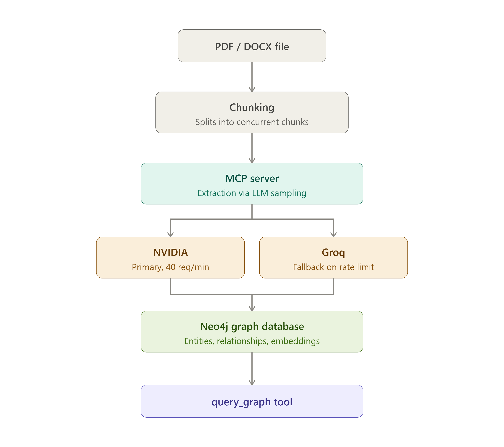

# Neo4j_MCP

A production-grade **GraphRAG MCP server** that turns unstructured documents into a queryable knowledge graph. Upload a PDF, DOCX, XLSX, or CSV — the server chunks it, extracts entities and relationships with an LLM, and writes them into Neo4j with semantic (embedding-based) search built in.

Built on the [Model Context Protocol](https://modelcontextprotocol.io), so it plugs into any MCP-compatible AI client (Claude, or any other MCP host) without custom integration work.

## Why MCP

This project started from a friend's question. He's into cinema, and wanted to map out actor and director careers — starting with a case like someone who began as a cameraman before becoming a director — so he could search a name and see everything connected to it: the films, the roles, who worked with whom, how one part of a career led into another.

I'd already built a pipeline that reads documents, extracts entities and relationships with an LLM, and writes them into Neo4j. I walked him through how it worked — how a graph database stores the relationship itself as the data, so a question like "how is this person connected to that one" is a graph traversal, not a query someone has to hand-design with joins across foreign keys. He understood it immediately, and that could've been the end of it — a good conversation, nothing built.

But he'd need to actually *use* this, not just hear about it — and without MCP, that means either I run the pipeline for him every time, or I hardcode it into a one-off app tied to a single LLM provider. Neither scales past one friend, one dataset.

MCP solves that: expose the pipeline once as a server, and any MCP-compatible AI client can connect to it directly — no custom integration per person, no separate app to build and maintain. He can point his own AI client at this server, upload a file, and build and query his own graph in natural language, without needing me in the loop at all.

That's the actual point of this project: not just "documents into a graph," but making that capability something anyone can plug into and use on their own.

## Architecture



**Key design decisions:**
- **Streaming chunking** — documents are split and processed chunk-by-chunk instead of loading the whole file into memory, so large files (1000s of pages) don't blow up RAM.
- **Bounded concurrency** — chunks are processed concurrently (semaphore-capped) rather than one at a time, cutting extraction time dramatically on large files.
- **SmartLLM fallback** — extraction calls go to NVIDIA's API first; if it's rate-limited or fails, the pipeline automatically falls back to Groq, so a single provider's limits don't stall the whole run.
- **MERGE-based writes with dedup** — entities are deduplicated on `(name, type)` and relationships are deduplicated on the edge itself, so re-running extraction (or overlapping chunk content) never creates duplicate nodes or edges.
- **Local embeddings** — entity names and relationship types are embedded locally (`sentence-transformers`, no API calls), enabling fuzzy semantic lookups later — e.g. querying "curie" correctly resolves to "Marie Curie".

## Tools

The MCP server exposes three tools:

| Tool | Description |
|---|---|
| `setup_neo4j_connection` | Connects to Neo4j and ensures the required constraints and vector indexes exist. Run this once before extraction. |
| `extract_and_store_entities` | Takes a file path, chunks the document, extracts entities/relationships from each chunk via LLM sampling (concurrently, with progress reporting), and writes them into Neo4j. |
| `get_entity_context` | Looks up an entity (or the relationship between two entities) using semantic matching — no exact spelling required. |

## Tech stack

- **MCP** (`mcp` / FastMCP) — server framework and LLM sampling
- **Neo4j** — graph database, with native vector indexes for semantic search
- **sentence-transformers** (`all-MiniLM-L6-v2`) — local embedding generation
- **LangChain text splitters** — chunking with configurable size/overlap
- **pypdf / python-docx / openpyxl** — document parsing (PDF, DOCX, XLSX, CSV)
- **asyncio** — concurrent chunk processing with semaphore-bounded parallelism

## Setup

### 1. Prerequisites
- Python 3.10+
- A running Neo4j instance (local, Docker, or [Neo4j Aura](https://neo4j.com/cloud/platform/aura-graph-database/))
- An NVIDIA API key (and optionally a Groq API key for fallback)

### 2. Install dependencies
```bash
git clone https://github.com/vaslin-dotcom/Neo4j_MCP.git
cd Neo4j_MCP
pip install -r requirements.txt
```

### 3. Configure environment
Create a `.env` file in the project root:
```env
NEO4J_URI=neo4j+s://your-instance.databases.neo4j.io
NEO4J_USERNAME=neo4j
NEO4J_PASSWORD=your-password

NVIDIA_API_KEY=your-nvidia-key
GROQ_API_KEY=your-groq-key
```

### 4. Run the server
```bash
python mcp_server/server.py
```

Connect it to your MCP client of choice (e.g. Claude Desktop) by pointing the client's MCP config at this server's entrypoint.

## Usage

Once connected via an MCP client:

1. Call `setup_neo4j_connection` to initialize the database.
2. Call `extract_and_store_entities` with a file path (PDF, DOCX, XLSX, or CSV) to build the graph. Progress is reported chunk-by-chunk as extraction runs.
3. Ask natural-language questions — the client calls `get_entity_context` under the hood to pull relevant graph context and answer.

**Example questions once a graph is built:**
- "Who is Marie Curie?"
- "Who did Marie Curie work with?"
- "How is Marie Curie connected to Pierre Curie?"

## Roadmap

- [ ] Package as a standalone application with a simple upload interface (no MCP client setup required)
- [ ] Support for additional file types
- [ ] Configurable extraction schema per domain

## Contributing / Questions

This project is under active development. If you're working with MCP, GraphRAG, or Neo4j and want to compare notes, open an issue or reach out directly.

## License

*(Add your chosen license here — e.g. MIT)*